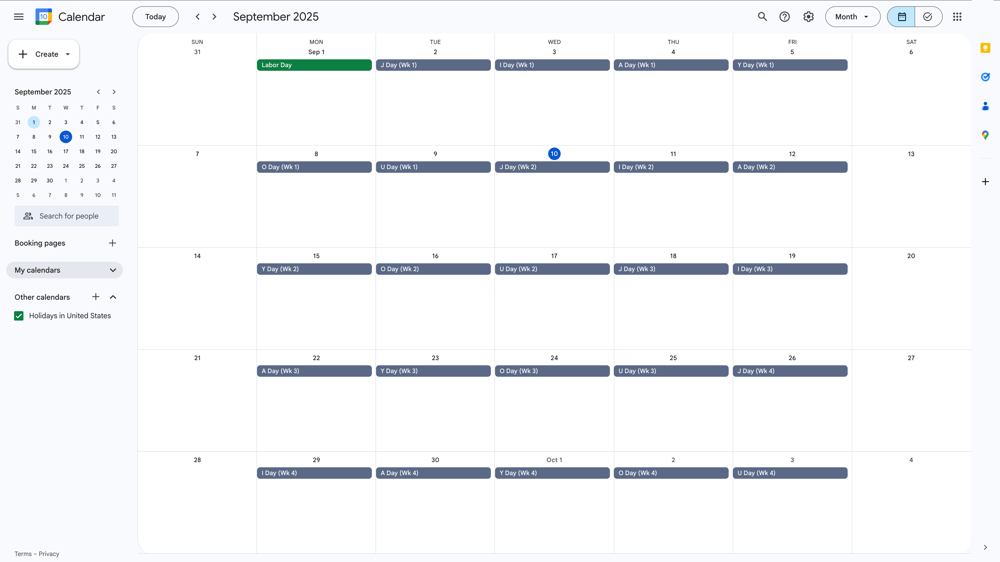

# Create 加油 ("jiā yóu") Calendar

Google Web app for creating a calendar of individual events that cycles the words "J Day," "I Day," "A Day," "Y Day," "O Day," and "U Day," except on weekends and holidays. Modify as needed, and back up your calendars before you run the app. Without an app script, one would need to create these events manually.

_Suggestion: Run this script in a summer before an upcoming school year; this is because the script will create events starting in the current year._

## Visual Example

 Form for creating "JIA YOU" calendar of events. (Username is hidden.)

 "JIA YOU" calendar of events was created.

## Prerequisite

Access to [Google Apps Script](https://script.google.com/)

## Getting Started

### Build and Deploy

1. Go to [Google Apps Script](https://script.google.com/), and create a new project.
2. Copy and paste [the script](./Code.gs) into the editor, and save the file.
3. Run the script to acquire authorization.
4. Create an HTML file, and name it "Index."
5. Copy and paste [the markup text](./Index.html) into the editor, and save the file.
6. Deploy the project as a Web app, and open the assigned URL.

### How to Use

7. Check the username to ensure that you opened the URL in the correct account.
8. Modify the calendar name and time zone.
9. Add any exceptions to the U.S. holiday schedule, any half-days, and any extra holidays. (Exceptions tell the app script to create events on these holidays; half-days tell the app script to skip this day; and extra holidays tell the app script _not_ to create events on these non-holidays.)
10. Modify the start and end months. (If the start month is greater than the end month, then the calendar will roll over to the new year.)
11. Expand the collapsible region, as well, to specify a date range by inputting a start date and end date. (For consistency, if the start date is later than the end date, then the calendar will roll over to the new year.)
12. Optionally perform a dry run to test the Web app before running it in production. Consult logs for output.
13. Press submit. (Requires another authorization. **_Note also that creating calendars is subject to a [use limit](https://support.google.com/a/answer/2905486?hl=en)._**)

## Next Steps

- If you deploy the Web app such that it executes as `User accessing the web app` where `Anyone with Google account` can access it, then you can share the URL for them to create a calendar in their own account. (You may wish to hide the dry run option.)
- Trim the calendar (e.g., delete letter days after Jun 12, if a school calendar ends on Jun 12)
- Consult the [Web app for adding events](https://github.com/saegl5/jiayou_add_events).
- You can extend the app script to create a calendar cycling any letters or words and in any language. Feel free to fork, too!
- You can also export the calendar directly from [Google Calendar](https://calendar.google.com/calendar/) and can import it into another calendar on your smartphone. Alternative: Check out Jonathan Hsieh's [AileenBot](https://account.aileenbot.com/), and subscribe to community events. ('Whatever way makes it easier for you to keep track of today's letter...)

Made with &heartsuit; in Visual Studio Code

 

A special thank you to [Chi (David) Yu](https://github.com/yuchild) and [James Armstrong](https://github.com/jmarmstrong1207). Chi contributed the idea of developing the app using Google Apps Script, and James contributed recurring events and regular expressions.
