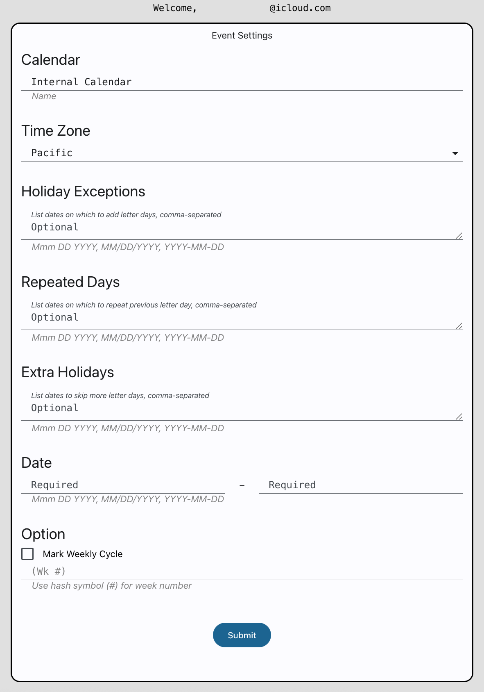

# Create 加油 ("jiā yóu") Calendar

Google Apps Script for batch creating a calendar of events that cycles the words "J Day," "I Day," "A Day," "Y Day," "O Day," and "U Day," except on weekends and holidays. Modify as needed, and back up your calendars before you run the script. These events are not recurring events, so without a batch script one would need to create these events manually.

## Visual Example

 Form for creating "JIA YOU" calendar of events.

 "JIA YOU" calendar of events was created.

## Getting Started

1. Go to [Google Apps Script](https://script.google.com/), and create a new project.
2. Copy and paste [the script](./Code.gs) into the editor, and save the file.
3. Create an HTML file, and name it "Index."
4. Copy and paste [the markup text](./Index.html) into the editor, and save the file.
5. Deploy the project as a Web app, and open the assigned URL.
6. Modify the calendar name, time zone, and public holiday calendar. (***Must name it differently from the owner name, otherwise the script will not create the calendar.***)
7. Add any exceptions to the holiday schedule, any half-days, and any extra holidays.
8. Modify the start and end months. (If the start month is greater than the end month, then the calendar will roll over to the new year.)
9. Press submit. (Requires authorization. ***Note also that creating calendars is subject to a [use limit](https://support.google.com/a/answer/2905486?hl=en).***)

Made with &heartsuit; in Visual Studio Code